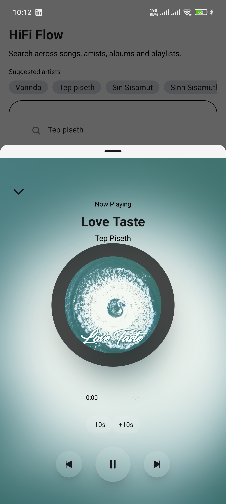
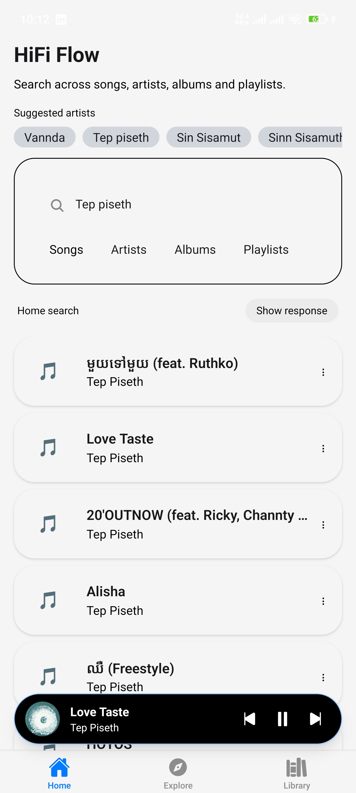

# Hifi Flow

Music player app with uniwind for Android, iOS and web

> **Disclaimer**: This project is for educational purposes only, testing `hero-native` with `uniwind` to build universal Expo apps (Android, iOS, and Web) with one codebase. We do not own the API used in this project. For any feedback or copyright concerns, please contact us via email. We will review and take action according to your request.

## Feature

- Simple with Hifi audio quality
- Daily favorite tracks

## Screenshots




## Tech Stack

- **TypeScript** - For type safety and improved developer experience
- **React Native** - Build mobile apps using React
- **Expo** - Tools for React Native development
- **TailwindCSS** - Utility-first CSS for rapid UI development
- **shadcn/ui** - Reusable UI components
- **Turborepo** - Optimized monorepo build system

## Getting Started

First, install the dependencies:

```bash
pnpm install
```

Then, run the development server:

```bash
pnpm run dev
```

Use the Expo Go app to run the mobile application.

## Project Structure

```
my-better-t-app/
├── apps/
│   ├── native/      # Mobile application (React Native, Expo)
```

## Available Scripts

- `pnpm run dev`: Start all applications in development mode
- `pnpm run build`: Build all applications
- `pnpm run dev:web`: Start only the web application
- `pnpm run check-types`: Check TypeScript types across all apps
- `pnpm run dev:native`: Start the React Native/Expo development server

## Related resources

- API used in this project Thanks to  Open source project [sachinsenal0x64](https://github.com/sachinsenal0x64/hifi)
- https://monochrome.tf/ - siloh46426@hudisk.com
- <https://github.com/uimaxbai/tidal-ui>
- Better-t-stack: <https://github.com/uimaxbai/better-t-stack>
- LLM: <https://github.com/gpt4free/g4f.dev/blob/main/docs/client_js.md>

## License

This project is licensed under the MIT License - see the [LICENSE](LICENSE) file for details.
